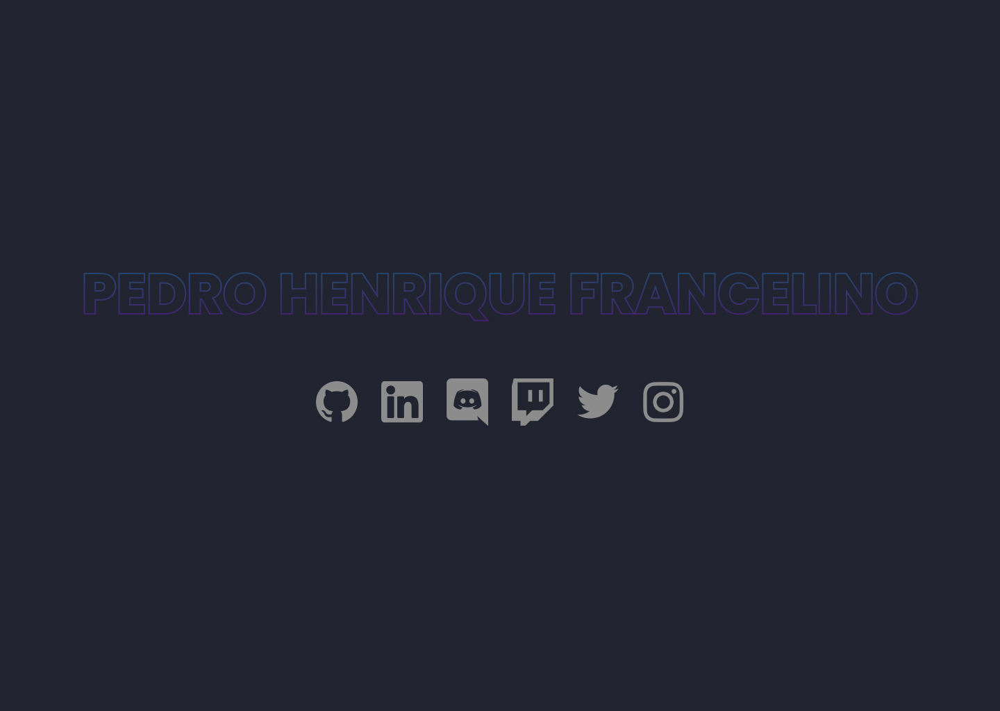

# Social Tree

Projeto baseado no desafio da Rocketseat.

| :placard: Vitrine.Dev |     |
| -------------  | --- |
| :sparkles: Nome        | **Social Tree**
| :label: Tecnologias |  html e css
| :rocket: URL         | 
| :fire: Desafio     | https://app.rocketseat.com.br/discover/challenges/social-tree

<!-- Inserir imagem com a #vitrinedev ao final do link -->

## Detalhes do projeto

Esse projeto é referente ao desafio de Social Tree na plataforma da Rocketseat. Personalizei no Figma esse layout e fiz o desenvolvimento dele usando HTML e CSS.

Com esse projeto pratiquei mais sobre responsividade e o flebox. Também pude aprender mais sobre animações no CSS.